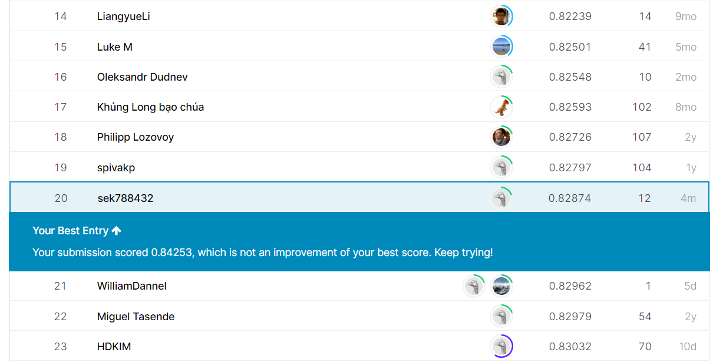

# DSAI_HW4

## Introduction
This is NCKU DSAI HW4. In this read me file, I will demonstrate how to run our code and briefly explain our idea in this competition.

!!!The preprocessed data is not uploaded due to file size limit. The TA of the class can get our full source code in the below link. Our best result on kaggle competition is not our final submit version because the model training time is above one hour.

---

## Execution
```sh
pip install -r requirements.txt
cd code
python main.py

```
---

## Competition
The competition we attend is predict future sales on kaggle.[Link](https://www.kaggle.com/c/competitive-data-science-predict-future-sales)
The goal in this competition is obvious. To predict the sales value in the future. RMSE as evaluation and ranking benchmark.

---

## Full Source Code (include preprocessed data)
https://drive.google.com/file/d/1AEp-gv1t2wY_fIxtoClNG6nj-5zhr_0U/view?usp=sharing

---

## Code
In this section I will briefly describe how we design our code.
Our code can break down in following parts.
* Data Cleansing
* Preprocessing
* Feature Engineering
* Model Fitting
* Result

## Data Cleansing
In this section, we clear some outlier or dupicate data. Specific mechanism can be find in our slides.
* Merge duplicate shop
* Remove shop didn't appear in test set
* Remve outliers

## Preprocessing
We observed that the test set data frame is quite different from the train data frame. We did some reorganise to the train data frame.Specific mechanism can be find in our slides.

## Feature Engineering
In this section, we are trying to find as many feature as possible. We did some research on kaggle and add some new feature. The following list is the feature that we add in our data frame.
* Item name grouping
* Merge music artist / first word of item
* Item name length
* Time feature
* Price feature
* Item category
* Shop city
* Number of unique item features
* Percentage change in an aggregate feature

Specific mechanism can be find in our slides.

## Model
We try the following models.
* Light GBM - final model
* XGBoost - bad performance, time limit exceed
* Deep nueral network - GPU environment not permitted

We use Light GBM as our final model.Specific mechanism can be find in our slides.

---

## Report link
https://docs.google.com/presentation/d/1um4vZ-wj9UeHzZp4CjvPU9EnJjlhM15c9_35MBN1Vqc/edit?usp=sharing

---

## Result
The following picture is our best score.


---

## Best Score

